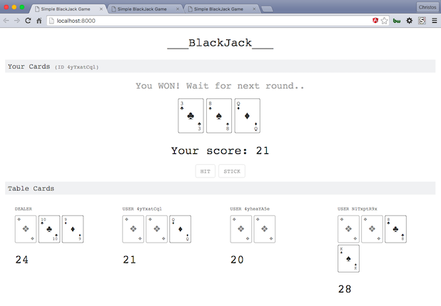

# Blackjack Game

Simple multi-user BlackJack application built in [Node.js](https://nodejs.org) and [Angular](https://angularjs.org/).

## Description 

This is simple multi-user BlackJack web app built in [Node.js](https://nodejs.org) and [Angular](https://angularjs.org/). Allows up to 7 users to connect from different windows/browsers and play BlackJack against a dealer. If more than 7 users connect, they enter a queue and wait for a slot to be freed. In any other case, users entering a running game will be prompted to wait for the next round, in which they will immediately take part.

All users share the same Deck and can see each other's moves/cards (except cards that are hidden - two cards per user are hidden and one card for the dealer). 

Users can `Hit` (take additional cards) or `Stick` (take a stand). Users take turns to play and have 10 seconds to act, which if passed, the respective user will be forced to *Stick* and the next player will take turn (a red 10-seconds countdown is shown next to the user's controls). Dealer plays last and determines losers/winners, while showing everyone their scores. The next game starts after a brief delay (approx. 10 secs - users are prompted accordingly).

If windows are left idle, connected users will auto-play given the timer (`Stick` on every round after the 10-seconds countdown). This is the expected behaviour, although may lead to a potential bug (see *known issues* below).

## Installation

The backend and frontend are bundled as different endpoints. The backend is a Node [socket.io](http://socket.io/) server and runs on port **3000**. The frontend is served from a different Express server on port **8000**. Included in the repository are all the development scripts. Switching to different ports requires changing configuration on both ends.

### Prerequisites

1. Install Node.js and npm (http://nodejs.org/).
2. Install bower and gulp:
	
	`npm install -g bower`

	`npm install -g gulp`

#### Setting up the Backend

1. Change directory to `blackjack-backend`
2. Install required packages:

	`npm install`

3. If all successful, start the server:

	`npm start`

#### Setting up the Frontend

1. Change directory to `blackjack-angular`
2. Install required npm and bower packages:

	`npm install`

3. If all successful, start the server:

	`npm start`

This should start the application (`http://localhost:8000`) in a new browser window. 

**Development notes**: The gulp script in the root of blackjack-angular watches for files in the `client` folder and reloads in the browser any changes made. The project uses JADE and Stylus instead of HTML/CSS for fast prototyping. A `public` folder is created with all the compiled sources, but that never needs to be edited in any way. There are options in the gulp file to inject the resulting JS scrips as a single minified file for production or multiple files in development (current mode is development).

## Playing

### Connecting multiple users

Once the frontend server is running, you may open `http://localhost:8000` in a new browser window and join a running game as another user (or new game if no active users). Reloading the browser will disconnect the current user and reconnect a new one. The current game will also restart. This is the expected behaviour although may also lead to a potential bug (see *known issues* below). You have a choice to Hit or Stick. 

### What to expect

Below is a screenshot of the application with *3* users connected.

## License

MIT

## Known Issues

- Functionality for Splitting has not been implemented.

- Users cannot place Bets. At the end of each round only winners/losers are determined.

- Users' scores are determined at the end, after the dealer plays. As it currently stands, a user can break the system if he/she keeps hitting until the Deck (there is only one Deck) is exhausted. This can be handled by flagging the user as "busted" when exceeding 21, rather than waiting until the end of the game to determine scores.

- As mentioned above, if windows are left idle, connected users will auto-play given the timer (stick on every round). This needs to be handled more properly. Maybe move idle users to another table/room or disconnect them altogether after a few rounds.

- Reloading the browser while playing a game will restart the current game - this would be the equivalent of someone walking away from a running game. Apparently this needs to be handled more properly.

- Timer would be better handled at the backend rather than the frontend (as it is currently) - for obvious reasons.

- Connected sockets are referenced in an array on the server (connected_sockets) to keep track of them and forcibly disconnect them when restarting the server. Ok for development, but will require better handling going forward. **Note*: this has been disabled alltogether for now.

- No tests.

